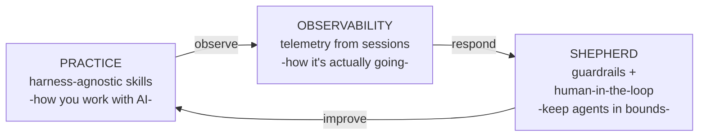

# Regimen

*A deliberate practice of engineering with AI agents.*

AI doesn't replace an engineer's practice. It raises the stakes on it. The developers shipping real software instead of AI slop are the ones putting hard-won engineering judgment into *how they work with* their coding agents. This is a system for doing that on purpose: three composable, harness-agnostic layers that hold up whether you run Claude, Codex, or Gemini.

**Practice** is the foundation: a curated, opinionated set of skills that encode how to work well with an agent. Everyone starts here, with a harness's built-in skills or ones they install. **Observability** is the easy add-on. It captures telemetry from every session (what you asked, which skills ran, where things drifted) and turns it into plain-English recaps and the metrics that tell you, objectively, whether a given model is earning its place. **Shepherd** is the optimization layer: guardrails that make it harder for an agent to go off-spec, and the judgment to route what needs a human in the loop versus what a capable model can safely validate itself.

The three are independent and composable: each pluggable, each installable on its own. Together they close a loop: you bring your practice, observability shows you how it actually went, and you respond by sharpening a skill or adding a guardrail. That loop is the point. It compounds, leaving every next session a little more disciplined.

## This repository

Regimen is a program, not a single project. This hub holds the program-level artifacts; the workstreams live in their own repos.

- [roadmap.md](roadmap.md): workstreams, sequencing, and the epic list
- [docs/observability-architecture.md](docs/observability-architecture.md): the observability module design
- [docs/observability-siblings.md](docs/observability-siblings.md): how Observability relates to Practice and Shepherd
- [docs/tracking.md](docs/tracking.md): how this multi-repo program is tracked

Board: https://github.com/orgs/niftymonkey/projects/9

## Workstreams

- **Practice**: `niftymonkey/claude`, `niftymonkey/skills`
- **Observability**: `niftymonkey/regimen-observability`
- **Visualization**: `niftymonkey/regimen-otlp-bridge`
- **Shepherd**: `niftymonkey/regimen-shepherd`
