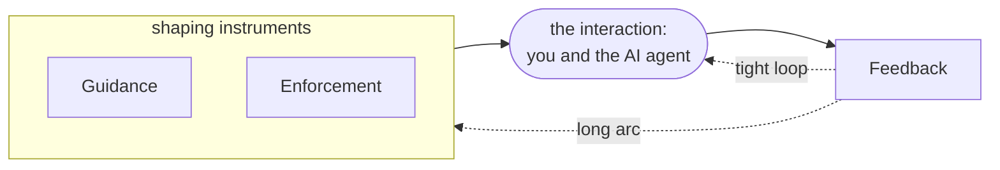

# Regimen

*Tools for working well with AI coding agents.*

AI's value in software engineering is conditional, not intrinsic. What separates good software from slop is not the model, it is the engineer's process: how work is framed, how context is supplied, how output is verified, what is and is not handed to the agent. Regimen makes that process explicit, portable across any agent CLI and any model, and improvable.

Working well with an AI agent is a practice. Regimen makes it concrete: a set of instruments you pick up one at a time, each earning its place by meeting a need you already feel.

## The three instruments

- **Guidance**: skills that encode good practice the agent is asked to follow. It instructs.
- **Enforcement**: any mechanism that makes an outcome happen deterministically, not at the model's discretion. Hooks, permission and tool gating, sandboxing, CI and pre-merge gates, schema-constrained outputs. It compels.
- **Feedback**: the instrument that watches how the work actually went and shows you, plainly and comparably, where the interaction is strong and where it is weak. It observes.

Each is adopted on its own. Guidance alone is useful. Add Enforcement when you need something to happen without fail. Add Feedback when you want to know whether any of it is working and what else might need to be added or sharpened.

## The loop

At the center is the interaction itself: you and the AI agent doing the work. Guidance and Enforcement shape it; Feedback observes it and closes two loops.



- **The tight loop** runs in the flow of work. Feedback shows how the current work is going, and you adjust your next move with the existing kit.
- **The long arc** runs across weeks. Patterns roll up, and you make a durable change to your kit: a sharper skill, a new guardrail, a routing change.

## Install

A full install is this hub plus the two instruments, cloned as siblings under one parent directory (the hub finds them by name next to itself). Feedback and Enforcement come from `regimen install`; the Guidance skills install separately.

### Prerequisites (only if missing)

- Bun: `curl -fsSL https://bun.sh/install | bash`
- jq, for the em-dash and inline-message gates: `brew install jq`
- `ANTHROPIC_API_KEY` exported, for the `feedback-judgment` skill

### Core (Feedback and Enforcement)

```bash
git clone https://github.com/niftymonkey/regimen.git
git clone https://github.com/niftymonkey/regimen-feedback.git
git clone https://github.com/niftymonkey/regimen-enforcement.git
cd regimen && ./install.sh
```

`./install.sh` installs dependencies, then runs `regimen install`, the thin orchestrator that shells out to each instrument's own install verb (Feedback, then Enforcement) and self-links the hub bin (`bun link`) so that `regimen` becomes a permanent bare command. After that first run, `regimen install` and `regimen uninstall` work from anywhere. Useful flags: `--dry-run` previews every step and changes nothing, `--codex-home <dir>` targets a non-default Codex home, and `--gate <name>` (repeatable) or `--no-gates` selects which Enforcement gates wire.

### Guidance skills (runs via npx, or bunx)

The Guidance pillar is not part of `regimen install`. It installs from the curated [`niftymonkey/skills`](https://github.com/niftymonkey/skills) with the [`skills`](https://github.com/vercel-labs/skills) CLI:

```bash
npx skills@latest add niftymonkey/skills -g -a codex -s '*' -y
npx skills@latest add mattpocock/skills  -g -a codex -s '*' -y
```

The CLI auto-detects the running agent, so `-a codex` pins the target and `-s '*' -y` installs the full set without prompts; confirm they landed with `ls ~/.codex/skills`. The niftymonkey set already vendors the MIT-adapted Pocock companions it builds on, so the second line is only for Pocock's own skills beyond those.

### Verify

```bash
codex features list                 # the hooks feature is on
feedback status                     # daemon running, recent last event
feedback evidence --harness codex   # read a captured session back
ls ~/.codex/skills                  # the niftymonkey and feedback skills are present
```

### The `--codex-home` non-hermetic caveat

`--codex-home` isolates ONLY the Codex home (the `hooks.json` and the installed skills under that directory). It does NOT redirect the rest of the install: the daemon and its systemd unit, the enabled flag in the Regimen data dir, and the `bun link` of each package are all GLOBAL and are not redirected by it. So a `--codex-home /tmp/...` "test" still writes the real daemon and links globally. For a more hermetic test, also set `REGIMEN_DATA_DIR` to override the data dir (the enabled flag); note the daemon/systemd unit and `bun link` remain global regardless.

## This repository

Regimen is a program. This hub holds the program-level artifacts; the instruments live in their own repositories:

- [`regimen-feedback`](https://github.com/niftymonkey/regimen-feedback): the Feedback instrument.
- [`regimen-enforcement`](https://github.com/niftymonkey/regimen-enforcement): the Enforcement instrument.
- [`skills`](https://github.com/niftymonkey/skills): high-value Guidance skills, curated and published by the author.
- [`regimen-otlp-bridge`](https://github.com/niftymonkey/regimen-otlp-bridge): an optional renderer that visualizes Feedback's signals in Grafana.

See [`PRD.md`](PRD.md) for what Regimen does and for whom, [`ARCHITECTURE.md`](ARCHITECTURE.md) for how it is structured, [`docs/plan.md`](docs/plan.md) for the implementation phases, and [`docs/adr/`](docs/adr/) for the decisions behind it. Work in flight is tracked on the [project board](https://github.com/orgs/niftymonkey/projects/9).
