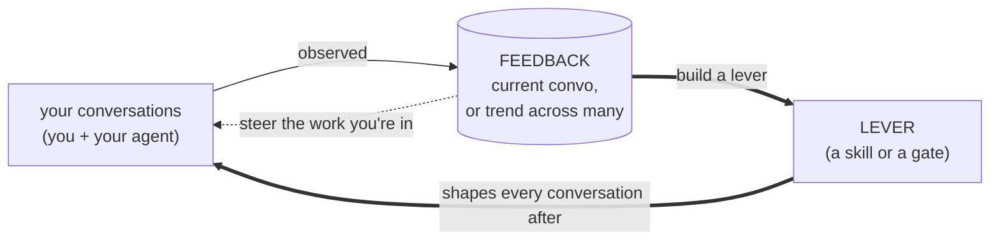

# Regimen

*Local observability for your AI-assisted engineering.*

AI's value in software engineering is conditional, not intrinsic. What separates good software from slop is not the model, it is the engineer's process: how work is framed, how context is supplied, how output is verified, what is and is not handed to the agent. Your process is the lever, a multiplier on whatever model and harness you use.

Today that process runs on feel. You carry impressions of whether a session went well, why, and whether a change helped, none of it grounded in data. Regimen turns the feel into data: observability for your AI-assisted engineering, portable across any agent CLI and any model.

## Feedback at the center, two levers in response

**Feedback** is the center: the observability that turns the feel into data. It observes how the work actually went and surfaces, plainly and comparably, where the interaction is strong and where it is weak. The question it answers about each thing you asked for: did the agent do what you wanted, and how much correction did that take? It measures the conversation, never your code, and never renders a verdict on you. What it surfaces is specific and grounded in what actually happened, never vague coaching like "get better at prompting."

> **It all stays on your machine.** This is telemetry on your own conversations, for you, kept in a local store. Regimen collects nothing. The only network activity is the judgment step, an LLM call to the same model provider you already use, never to Regimen.

In response to what Feedback shows, you reach for one of two levers:

- **Guidance** offers the agent something to work with: a skill to follow, a line in `CLAUDE.md` or `AGENTS.md`, an MCP server or CLI it can use. It asks.
- **Enforcement** makes an outcome deterministic, taking the choice away from the model: a hook or gate, a permission boundary, a CI or pre-merge check, a sandbox, schema-constrained output. It compels.

The levers are categories of response, not a catalog Regimen ships. Their contents are yours, drawn from what your own Feedback surfaces and often specific to you and your harness. Regimen ships almost none of it; its real work is to read what happened, point you at the specific move worth making in either category, and show whether it helped.

## The loop: see, act, validate

You run this loop in conversation with your agent, at whatever scale fits: the conversation you're in, or the trend across all of them.



- **See.** You ask how things are going, about the conversation you're in or the trend across many, and your agent reads Feedback (the evidence and the judged read) and tells you the pattern.
- **Act.** You respond however the pattern warrants: a quick steer to the work you're in, or a lever (a skill that asks, a gate that compels) that holds for every conversation after. Both are on the table at either scale; spotting something once in a long session is reason enough to build something lasting.
- **Validate.** You ask again later, and Feedback shows whether it moved, whether you're checking this session or the trend.

## Install

A full install is a single clone of this monorepo. Feedback and Enforcement come from `regimen install`; the Guidance skills install separately.

*Where this is today: per-conversation reads (evidence and judgment) and the slice-able history are live; the over-time synthesis and Regimen's own suggestions of what to build next are still being built.*

### Prerequisites (only if missing)

- Bun: `curl -fsSL https://bun.sh/install | bash`
- jq, for the em-dash and inline-message gates: `brew install jq`
- `ANTHROPIC_API_KEY` exported, for the `feedback-judgment` skill

Everything Regimen captures stays in a local store on your machine. The key above is only for the judgment step's LLM call, to your own model provider, never to Regimen.

### Core (Feedback and Enforcement)

```bash
git clone https://github.com/niftymonkey/regimen.git
cd regimen && ./install.sh
```

`./install.sh` installs workspace dependencies, then runs `regimen install`, the unified orchestrator (the `@regimen/cli` package) that dispatches to each instrument's install logic in-process (capture first, then the gates) and self-links the `regimen` bin (`bun link`) so that `regimen` becomes a permanent bare command. After that first run, every lifecycle verb works from anywhere: `regimen install` (add the current harness), `regimen install --all` or `regimen install --harnesses <list>` (install for several harnesses at once), `regimen update` (re-resolve the install in place after the clone moves or upgrades), `regimen uninstall`, and `regimen status` (version, installed harnesses, and scopes). Useful flags: `--dry-run` previews every step and changes nothing, and `--gate <name>` (repeatable) or `--no-gates` selects which gates wire. The harness is auto-detected per invocation, or set explicitly with the `REGIMEN_HARNESS` environment variable.

### Guidance skills

Skills are one of the most common forms of Guidance, and the one with a quick install path. They come from wherever suits you: the built-ins your harness already ships, collections you install with the [`skills`](https://github.com/vercel-labs/skills) CLI, or ones you build yourself with the LLM's help. Regimen ships none of them. What it adds is the read from Feedback that points you at which skill is worth building or finding next.

A few examples of what a Guidance skill can be:

From `mattpocock/skills`:
- `domain-modeling`: pin down a project's domain language and the decisions behind it.
- `prototype`: a throwaway build to flesh out a design before you commit.
- `tdd`: drive features and fixes test-first.

From `niftymonkey/skills`:
- `architect-deep`: sketch a module's architecture with deep-module thinking before any code.
- `externalize`: continuously write hard-won context to a handoff file so it survives a full context window.
- `work-router`: decide whether a unit of work stays in the conversation or routes off-thread. Its own design called for "an automated feedback store," the gap Regimen fills.

Browse a collection with `npx skills@latest add <owner>/skills --list` and take what fits.

### Verify

```bash
codex features list                 # the hooks feature is on
regimen daemon status               # daemon running, recent last event
regimen evidence                    # read a captured session back
ls ~/.codex/skills                  # the feedback skills, plus any you installed
```

## This repository

Regimen is a program. This monorepo holds the program-level artifacts plus every instrument as a workspace package under `packages/`:

- [`packages/feedback`](packages/feedback): the Feedback instrument.
- [`packages/enforcement`](packages/enforcement): the Enforcement instrument.
- [`packages/otlp-bridge`](packages/otlp-bridge): an optional renderer that visualizes Feedback's signals in Grafana.
- [`packages/cli`](packages/cli): the `regimen` orchestrator that installs the instruments.
- [`skills`](https://github.com/niftymonkey/skills): a collection of Guidance skills the author maintains, one source among many, installed separately.

See [`PRD.md`](PRD.md) for what Regimen does and for whom, [`ARCHITECTURE.md`](ARCHITECTURE.md) for how it is structured, [`docs/plan.md`](docs/plan.md) for the implementation phases, and [`docs/adr/`](docs/adr/) for the decisions behind it. Work in flight is tracked on the [project board](https://github.com/orgs/niftymonkey/projects/9).
