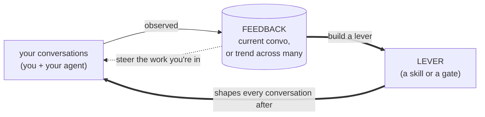

# Regimen

*Local observability for your AI-assisted engineering.*

AI's value in software engineering is conditional, not intrinsic. What separates good software from slop is not the model, it is the engineer's process: how work is framed, how context is supplied, how output is verified, what is and is not handed to the agent. Your process is the lever, a multiplier on whatever model and harness you use.

Today that process runs on feel. You carry impressions of whether a session went well, why, and whether a change helped, none of it grounded in data. Regimen turns the feel into data: observability for your AI-assisted engineering, portable across any agent CLI and any model.

The job it is hired for: tell me how well my AI work is actually going, why, and whether the changes I make to improve it are working, so I stop leaving value on the table and stop guessing.

## The four things it helps you improve

Every one of these is something you control.

1. **How you set the work up.** Whether a session dragged because the goal, scope, or context was not clear up front, and how to state it more clearly next time, or a bit of setup that front-loads that clarity for you.
2. **How you run it.** Whether you are decomposing, delegating, and knowing when to step in or reset, versus letting a run spiral, micromanaging it, or drowning your own context. And when the same thing keeps happening, something that runs that kind of work the right way for you.
3. **How you check what comes back.** Whether you actually verified the AI's output or waved it through. This is the one you cannot see in yourself, because you cannot notice a check you never made. And where the check can be mechanized, something that runs it for you before you accept.
4. **The durable setup you build around all of it** (your skills, rules, hooks). Whether it is being used, working, missing, stale, fighting itself, or costing more than it saves. And if you are just starting: what setup to adopt that you did not know existed.

You can ask this about the conversation you're in or the trend across many, and check whether it holds across model and harness. When something goes worse than it should have, Regimen tells you why, your setup, the AI, or your tooling, so you fix the right thing. It surfaces the pattern, names the kind of fix, and offers to help you build it, but it never makes the move. You decide, you act.

## Your data stays on your machine

Your telemetry stays in a local store on your machine. Nothing goes to a Regimen server, there is none. The one exception is assessment: to judge your work, the captured data for the conversations being assessed is sent to the same LLM you are already using.

## Three ways to reach a judge

Assessment needs an LLM, and there are three equally good ways to give it one. Use whichever matches what you already have:

- **An API key.** Set `REGIMEN_JUDGE_API_KEY`, `REGIMEN_JUDGE_BASE_URL`, and `REGIMEN_JUDGE_MODEL` in `~/.config/regimen/env` to judge through any OpenAI-compatible provider, Anthropic included. A keyless local endpoint such as Ollama works too.
- **The `claude` CLI.** If `claude` is on your PATH, Regimen shells out to it and uses the login you already have. No key involved.
- **No key, no CLI.** The agent you are already talking to can be the judge itself: `regimen assess --emit-prompt` hands it the judging prompt, and `--record-verdict` stores its verdict. The bundled skill drives this end to end.

Regimen picks automatically from what is available; `--judge-via` pins a specific one.

## How it works: Feedback, and two levers

**Feedback** is the center: the observability that turns the feel into data. It observes how the work actually went and surfaces, plainly and comparably, where the interaction is strong and where it is weak. The question it answers about each thing you asked for: did the agent do what you wanted, and how much correction did that take? What it surfaces is specific and grounded in what actually happened, never vague coaching like "get better at prompting."

In response to what Feedback shows, you reach for one of two levers:

- **Guidance** offers the agent something to work with: a skill to follow, a line in `CLAUDE.md` or `AGENTS.md`, an MCP server or CLI it can use. It **ASKS** the agent to work a particular way.
- **Enforcement** makes an outcome deterministic, taking the choice away from the model: a hook or gate, a permission boundary, a CI or pre-merge check, a sandbox, schema-constrained output. It **COMPELS**, so the outcome does not depend on the model.

The levers are categories of response, not a catalog Regimen ships. Their contents are yours, drawn from what your own Feedback surfaces and often specific to you and your harness. Regimen ships almost none of it; its real work is to read what happened, point you at the specific move worth making, and show whether it helped.

## The loop, in practice

You never open a dashboard. You ask your agent a plain question, in whatever tool you happen to be in, and it does the reading for you.

> **You:** how have my sessions gone this week?
>
> **Agent:** Pretty good week: 23 conversations, two thirds got where they were going. The catch is four of the finished ones needed heavy correction, and they share a shape: refactors where the goal was stated but the boundaries were not. Want me to draft a short standing note that pins the do-not-touch surface before any refactor starts? You choose whether to install it.

It goes like this. You ask how things are going, and the agent reads what actually happened and tells you the pattern in plain terms, not a score. If something is worth fixing, it comes back as an offer: a quick steer for the session you're in, or a lasting change, a skill or a gate, that holds for every conversation after. You decide, it acts with you. Then it follows up on its own, so whether the change worked never depends on you remembering to ask again.


```mermaid
flowchart LR 
    Conv["your conversations<br/>(you + your agent)"]
    FB[("FEEDBACK<br/>current convo,<br/>or trend across many")]
    Lever["LEVER<br/>(a skill or a gate)"]

    Conv -->|observed| FB
    FB -.->|"steer the work you're in"| Conv
    FB ==>|"build a lever"| Lever
    Lever ==>|"shapes every conversation after"| Conv
```

## Works with

Regimen works with Claude Code, Codex, Copilot, and Gemini, and captures across all of them into one local store. It runs on Linux, macOS, and native Windows.

## Install

### Prerequisites (only if missing)

- [Bun](https://bun.com/docs/installation)

### Clone and install

**macOS / Linux**

```bash
git clone https://github.com/niftymonkey/regimen.git
cd regimen && ./install.sh
```

**Windows (PowerShell)**

```powershell
git clone https://github.com/niftymonkey/regimen.git
cd regimen; .\install.ps1
```

Two Windows notes. If your agent CLIs run inside WSL, install there with `./install.sh` instead; use `install.ps1` only when the CLIs run natively in Windows. If PowerShell blocks the script ("running scripts is disabled"), run it as `powershell -ExecutionPolicy Bypass -File .\install.ps1`. If capture later does not fire, `check-windows-env.ps1` is a read-only check of whether your environment is set up for it.

The installer installs workspace dependencies, runs `regimen install`, and links the `regimen` command (`bun link`) so it becomes a permanent bare command. After that first run, `regimen` works from anywhere: `regimen status` shows what is installed, `regimen update` re-resolves after the clone moves or upgrades, `regimen install` adds another harness, and `regimen uninstall` removes it.

### Verify

```bash
regimen status   # installed version and harnesses, plus daemon health
```

## Learn more

See [`PRD.md`](PRD.md) for what Regimen does and for whom, [`ARCHITECTURE.md`](ARCHITECTURE.md) for how it is structured, [`docs/plan.md`](docs/plan.md) for the implementation phases, and [`docs/adr/`](docs/adr/) for the decisions behind it.

## License

Regimen is licensed under the Apache License 2.0. See [`LICENSE`](LICENSE).
