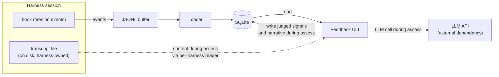

# Feedback stores structure and signals; conversation content stays in harness files

> Status: accepted (2026-05-19)

Feedback stores its own data in one local SQLite file: structural events (timestamps, tool names, tool call ids, event boundaries, no payload bodies), deterministic signals, judged signals, and narrative prose, all as tables. It does not duplicate the conversation itself. Prompt text, tool inputs and outputs, and assistant text live in the harness's transcript file on disk, which is the canonical record; the Feedback CLI reads from that file via a per-harness transcript reader only when judging is requested. At the capture edge, a JSONL buffer at each harness hook decouples writing from the store, and a loader drains it into SQLite. The result is one durable place for our structured data, no second durable copy of the user's prompts and responses, and one place every downstream tool reads from.

## Shape

## The pieces

**Capture hook (per harness).** A small per-harness adapter that runs inside the harness's hook system and appends each event payload as a JSON line to the buffer. It does no translation; the event is appended in whatever shape the harness gives it. This is the only Regimen code that runs inside the agent's process, so keeping it minimal is the point: a new harness's hook is genuinely "append a JSON line whenever the harness fires an event."

**JSONL buffer at the capture edge.** Holds events in whatever shape the harness emits, since the loader is the only reader and no uniform format is needed at this layer. The buffer exists no matter what, because asking the hook to do anything heavier (translating to the v1 schema, embedding SQLite, owning a database schema, handling WAL locking across concurrent sessions) would violate the harness-agnostic spine. It is genuinely transient: the loader drains it into SQLite and rotates the consumed files away, so events live in SQLite alone and the buffer never accumulates a parallel log on disk.

**The loader.** The full ETL of the architecture: drains the JSONL buffer (extract), translates each harness-native event into the v1 schema via a per-harness translator (transform), then writes the resulting structural events into the `events` table and computes deterministic signals into signal tables (load). Translation lives here rather than in the hook so the hook stays truly dependency-light (no schema knowledge, just append) and all schema-mapping logic stays in our codebase, where it can be tested and evolved without touching anything that runs inside the agent's process.

**SQLite as the store.** One file gives both queryability (distributions, trends, slices) and durability for non-rebuildable state (judged signals and narrative prose, since re-running the LLM judge per query is unaffordable). It holds four kinds of tables: structural events (timestamps, tool names, tool call ids, event boundaries, with no conversation content), deterministic signal tables, judged signal tables, and a narrative table. **Conversation content is deliberately absent.** Prompt text, tool inputs and outputs, and assistant text live in the harness's own transcript file on disk; the CLI reads them from there only when judging needs them. This keeps our store small, avoids a second durable copy of the user's prompts and responses, and treats the harness's transcript as the canonical record it already is.

The **Feedback CLI** reads SQLite to display whatever is there (signals, prose; no LLM call needed). When asked to assess, it additionally reads conversation content from the harness's transcript file via a per-harness reader, calls an external LLM with a versioned prompt and schema, and writes the resulting judged signals and narrative back to SQLite. The LLM call is the only network dependency in the architecture; reusing the engineer's already-configured LLM (the same one running their work) is the desired direction in future design. The optional OTLP bridge, not shown in the diagram, reads SQLite and projects signals to Grafana for those who want dashboards.

## Considered options

- Discard structural events; store only derived signals. Rejected: structural events are the queryable record that signals project from and the anchors the judge uses to point at specific moments in a conversation. Without them, new deterministic signals could not be added later (nothing to backfill from), and the judge would have nothing to cross-reference its claims against.
- Duplicate conversation content in our SQLite store too. Rejected: every prompt, every tool I/O body, and every assistant message would be stored twice on the user's disk (once in the harness's transcript file, once in ours). The disk and privacy cost is real; the benefit, being able to re-judge after the user deletes their harness file, is marginal compared to the cost.
- Three separate stores (JSONL log plus a SQLite signal store plus narrative files). Rejected: every reader has to know about three locations and keep them consistent. The narrative is not a signal but does not require its own file; an un-indexed table in the same SQLite file holds it fine.
- Have the capture hook write SQLite directly. Rejected: raises the floor for every future capture adapter (embed SQLite, own the schema, handle WAL locking across concurrent sessions). Appending JSONL is something any shell can do, which preserves the harness-agnostic spine.
- Translate harness-native events to the v1 schema in the capture hook (rather than in the loader). Rejected: any work in the hook runs inside the agent's process on every event and raises the bar to add a new harness. Centralizing translation in the loader keeps the hook contract to "append a JSON line" and puts all schema-mapping logic in our codebase, where it can be tested, evolved, and debugged without touching the hot path.
- Treat JSONL as the durable raw record and SQLite as a disposable cache. Rejected: judged signals and narrative prose live only in SQLite and are not rebuildable, since re-running the LLM judge is unaffordable. SQLite holds non-disposable state, so it must be the source of truth; the JSONL buffer is genuinely transient.

## Consequences

The judge requires the harness's transcript file to exist at judge time. If the user or harness deletes that file, the conversation can no longer be judged or re-judged; judged signals and narrative already written stay in SQLite, and all structural and deterministic signals remain queryable. The cost of supporting a new harness is three small adapters: a capture hook (append a JSON line whenever the harness fires an event), a loader-side translator (harness-native to v1 schema), and a transcript reader (used at judge time). Only the hook runs inside the agent's process, and it does the minimum possible; the translator and reader live in our codebase and run offline, so their complexity does not affect the agent's runtime. The LLM API call during assess is the architecture's only network dependency; future work explores reusing the engineer's already-configured LLM rather than a separately-set-up one.
