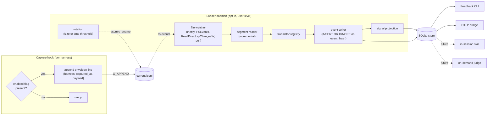

# Feedback's loader is an opt-in always-on daemon; the SQLite store stays fresh in near-real-time

> Status: accepted (2026-05-20)

The Feedback loader is an opt-in user-level daemon that follows the JSONL buffer in near-real-time, translates each event into a canonical v1 event via a per-harness translator, writes events into SQLite with `INSERT OR IGNORE` keyed on a sha256 hash of the normalized line, and projects deterministic signals into signal tables in the same transaction. Freshness is the design substrate: the CLI, the OTLP bridge, an in-session skill that queries SQLite, and a future on-demand judge all read a store that reflects what just happened, not a snapshot from the last batch. The daemon and the capture hook share one enabled flag: when Feedback is on, the hook appends and the daemon writes; when Feedback is off, the hook is a no-op and the daemon stops, so a sensitive conversation is never captured in the first place. Real-time visibility is the headline feature, and it is opt-in to install; install messaging is honest that without it the Feedback instrument is essentially useless.

## Shape

## The pieces

**Capture hook.** Per harness, runs inside the agent's process on every event. First action: stat the enabled flag at a known path (under a Regimen-owned data directory, resolved per OS via the runtime's standard user-data-dir API). If absent, the hook returns immediately, no append, no I/O beyond the stat. If present, it opens the buffer's `current.jsonl` in append mode, creating it if it does not exist, writes one JSON line of the form `{ "harness": "...", "captured_at": "<RFC3339>", "payload": <raw harness payload> }`, closes, exits. The line is the raw harness payload wrapped in a minimal envelope; translation lives in the loader. One stat per event is the entire cost of the privacy gate, and it is the same cost on every harness and on every OS.

**The enabled flag.** A single file at a fixed path that gates both the hook and the daemon. `feedback start` creates it; `feedback stop` removes it. The hook reads it on every event; the daemon checks it on a short cadence and self-exits if removed. Treating capture and storage as one gate is what makes the privacy guarantee real: nothing is appended while Feedback is off, so there is no buffer to purge when the user toggles back on.

**The buffer.** `current.jsonl` for active appends, plus zero or more `sealed-<rfc3339>.jsonl` segments that the daemon rotated out for size or age bounding. The daemon owns rotation; the hook never knows it happened. Rotation uses an atomic file rename. On Linux and macOS this is unconditional: a hook subprocess that opened the old inode keeps writing into the sealed file (those bytes are still followed by the daemon), and the next hook to append creates a fresh `current.jsonl`. On Windows, the same atomic rename works when the file is opened with delete-share permissions, which is the default in Node and Bun's append mode on supported runtime versions; the implementation verifies this on the targeted runtimes at build time and falls back gracefully when a rename collides with an active hook (see "Cross-platform support" below).

**File watcher.** Abstracted over the OS-native file-change mechanism: `inotify` on Linux, `FSEvents` on macOS, `ReadDirectoryChangesW` on Windows, with a short-cadence polling fallback for environments where the native mechanism is unavailable. The cross-platform abstraction is taken from an existing library (chokidar or the runtime's equivalent), not hand-rolled. The watcher emits "buffer changed" notifications; the segment reader does the actual reading. The seam is internal to the daemon; tests substitute a synthetic notification stream.

**Segment reader.** On daemon start, walks every JSONL file in the buffer from the beginning, yielding lines. Idempotency in the writer makes re-reading already-committed events a no-op, so there is no checkpoint file to keep consistent. In steady state, the reader follows `current.jsonl` incrementally from the last successfully-read byte (tracked in memory only, not persisted), reads new lines as the watcher signals appends, and switches to a freshly-rotated `current.jsonl` when the daemon rotates. A malformed line is quarantined and the reader continues.

**Translator registry.** A pure in-process map from a normalized harness identifier (`claude`, `codex`, `cursor`, `gemini`, `opencode`, `copilot`) to a stateless pure function from `(payload, env)` to `v1Event | null`. Returns `null` for raw events with no v1 mapping. Translators live in the `regimen-feedback` repo; adding a harness is one new file plus one map entry. This is the only harness-specific seam in the entire loader.

**Event writer.** Computes `event_hash = sha256(canonical_json(event))` for each translated event, then `INSERT OR IGNORE INTO events (event_hash, ...) VALUES (...)`. Idempotency is structural: re-ingesting the same line on a restart produces the same hash and the insert is a no-op. No checkpoint table is needed because the hash is the dedup key.

**Signal projection.** A small engine that runs registered signal functions over each event as it lands and updates signal tables in the same transaction as the event write. Projections are idempotent under replay via deterministic upsert keys: `session_id` for the conversations rollup, `(session_id, tool_call_id)` for tool-call spans, `(session_id, file_path)` for repeated-file edits. Single-event GROUP BY signals stay as SQL views over `events`, not materialized.

**Buffer rotation.** Owned by the daemon on a size or time threshold (defaults: rotate when `current.jsonl` exceeds a few megabytes or has been active for an hour, whichever first). Rotation is a single atomic file rename. After rotation, the daemon continues following the new `current.jsonl`. A sealed segment is deletable once every byte has been read and the corresponding transactions have committed; the daemon unlinks it then. Rotation in this design exists only to bound the size of `current.jsonl` for fast restart recovery; it is not the freshness mechanism, and it is not load-bearing for correctness, since idempotency makes a full re-read of a non-rotated `current.jsonl` safe. On Windows, if a rename attempt collides with an in-flight hook open, the daemon backs off and retries; persistent failure leaves the file unrotated but does not stall the daemon.

**Loader driver.** The composition root. Lifecycle is `start()`, `stop()`, and a health surface (last event timestamp, lag, backlog bytes, watcher mode). The CLI exposes `feedback start`, `feedback stop`, `feedback status`, and `feedback restart`. `feedback install-daemon` writes the user-level service definition appropriate to the OS (a `launchd` LaunchAgent plist on macOS, a `systemd --user` unit on Linux, a Task Scheduler entry on Windows) so the daemon survives logouts; the CLI dispatches by platform and the architecture is unchanged. Users who decline the install can run the daemon foreground in a terminal for development. A `feedback purge` command explicitly discards the buffer and (under a confirm flag) the SQLite store, for users who want a clean reset.

**The store schema.** One SQLite file. The loader owns these tables and writes them; the judge will add its own tables in a later ADR:

- `events`: one row per v1 event. Columns: `event_hash` (BLOB primary key), `schema_version`, `trace_id`, `session_id`, `timestamp`, `harness`, `model` (nullable per ADR-0005), `event_type`, `span_phase`, `span_name`, `attributes` (JSON text). Indexes: `(trace_id, timestamp)`, `(session_id, timestamp)`, `(event_type, timestamp)`. The open `attributes` bag stays JSON, queryable through `json_extract` on demand.
- `conversations`: one row per session, rolled up incrementally. Drives the conversation-first list view. Carries `session_started_at` and `session_ended_at` as nullable timestamps; an open conversation has `session_ended_at = NULL` and is rendered as open. Per the "Honest over tidy" principle in `feedback-surfacing.md`, the loader never imputes a `session.end`.
- `tool_call_spans`: paired `tool.pre` and `tool.post`. `ended_at` and `duration_ms` are nullable; an unpaired call leaves them `NULL`, never force-closed. A `gate.denial` matching the same `tool_call_id` fills `denied_by_gate_id`. Primary key `(session_id, tool_call_id)`.
- `repeated_file_edits`: per `(session_id, file_path)` edit count and last-edited timestamp, derived from `tool.post` of `Edit` and `Write`.
- `gate_denials`: one row per `gate.denial` event. Primary key `(session_id, tool_call_id, gate_id)`.
- `quarantine`: lines that could not be translated. The daemon logs them here and continues.
- `schema_migrations`: a single integer-versioned ledger. Both the loader's migrations and the judge's eventual migrations share this ledger.

Tool-mix histograms, prompt counts, compaction counts, and similar single-event aggregations are exposed as SQL views over `events`, not materialized.

## Cross-platform support

Regimen supports Linux, macOS, and Windows as first-class targets. The design uses cross-platform vocabulary (append mode, atomic rename, OS-native file watcher) rather than POSIX-specific syscall names, and every OS-dependent piece sits behind an abstraction that has a working implementation on all three platforms:

- The capture hook's `stat` and append-mode open are portable in every modern Node and Bun runtime.
- The file-watcher seam uses an existing cross-platform library that abstracts `inotify`, `FSEvents`, `ReadDirectoryChangesW`, and a polling fallback.
- The advisory file lock used to serialize `feedback start`, `feedback stop`, and `feedback restart` against each other uses a cross-platform lockfile library, not the OS-specific syscall.
- The service-unit installation in `feedback install-daemon` dispatches by OS to the platform's user-level supervision mechanism.

The one Windows-specific concern is rename-while-held: a hook subprocess may have `current.jsonl` open at the moment the daemon attempts to rotate. On Linux and macOS this is unconditionally safe. On Windows, it is safe when the file was opened with delete-share permissions, which is the default in modern Node and Bun's append mode. The implementation verifies this on the targeted runtime versions; if a rename attempt collides with a still-open handle, the daemon backs off and retries. Rotation is not load-bearing for correctness (idempotency absorbs any replay), so persistent rename failure degrades to "unrotated buffer" rather than to data loss or duplication.

WSL is treated as Linux. Users on native Windows install the Windows service definition; users on Windows running their harnesses inside WSL use the Linux install path.

## Multi-conversation concurrency

The buffer is shared across every active conversation on the machine: each harness session's capture hook appends to the same `current.jsonl` from its own subprocess, and several may fire at once. Append atomicity comes from the regular-file write itself, not from any cross-process lock. On Linux and macOS, `open(O_APPEND)` plus `write()` of one envelope line is a single kernel-atomic operation for writes up to `PIPE_BUF`, so concurrent hook subprocesses interleave at line granularity, never within a line. On native Windows, the same property holds when the file is opened with `FILE_APPEND_DATA` access (Node and Bun's append-mode default), which serializes appends inside the filesystem driver. The hook never reads or seeks; it only appends, so no cross-process coordination is needed.

The failure mode is a single torn line, and it is handled by the existing quarantine path rather than by tighter locking. If a write does straddle a kernel boundary (a hook envelope exceeds `PIPE_BUF` and the kernel commits the halves around another appender's write), the resulting line fails `JSON.parse` and the loader inserts one quarantine row with the raw bytes, leaving the events table untouched and continuing past it. Event-hash idempotency means a hook that retries on a partial write does not double-write the event. The `regimen-feedback` repo carries a stress test (`tests/concurrent-producers.test.ts`) that fires 100 hook subprocesses across four sessions at the same buffer and asserts zero quarantine, zero clobbering, and a correct per-session row count.

## Freshness, crash recovery, and idempotency

Freshness is bounded by the watcher latency (sub-second on `inotify` and `FSEvents`, the polling interval on the fallback) plus one SQLite transaction. The store reflects what happened a moment ago, not a moment from the last batch.

Crash recovery has one rule: on daemon start, re-read every JSONL file in the buffer from the beginning. The hash key on `events` and the deterministic upsert keys on the signal tables make the re-read a no-op for rows already committed. There is no persisted offset and no checkpoint file; the re-read cost is bounded by the rotation threshold, which is what rotation is for.

Idempotency holds across every replay path: a re-read on restart, a duplicate append from a racing hook subprocess that held the old inode across a rotation, a malformed-line retry. All collapse to the same set of `event_hash` rows.

A daemon that dies while the enabled flag is still present is observable via `feedback status` (the CLI checks the daemon's pid or socket and surfaces it explicitly). The hook keeps appending while the daemon is down; on next start, the daemon catches up.

## Considered options

- **Triggered batch drain on every CLI read (the earlier draft of this ADR).** Rejected. Stale-by-design contradicts Regimen's stated tight-loop intent: the tight loop is about what is actionable in a tighter loop, not a time bucket after the conversation ends, so the substrate has to keep SQLite fresh continuously. A lazy drain also closes the door on the future use cases the architecture is meant to preserve (in-session skill querying SQLite, on-demand judge mid-conversation, near-real-time Grafana via the bridge), each of which assumes a store that reflects the present.

- **Always-on daemon installed by default at first run.** Rejected. Background processes installed without explicit consent are user-hostile, and Feedback's value is conditional on the engineer wanting longitudinal visibility, so the install must be a deliberate opt-in. The honest message is that without the daemon the Feedback instrument is essentially useless; the user opts in or chooses not to use Feedback.

- **Daemon-only privacy toggle with explicit `feedback purge`.** Rejected. Two gates (the daemon switch and a separate purge step) mean a forgotten purge leaks a sensitive conversation into SQLite. Treating capture and storage as one gate via the enabled flag is the only model where "Feedback is off" actually guarantees "nothing was captured."

- **Daemon with persisted byte-offset checkpoint per segment.** Rejected for this stage. The combination of bounded buffer size (via rotation), event-hash idempotency, and a re-read from the beginning on restart is simpler and bounded in cost. A checkpoint file adds state that must stay consistent with the JSONL files and the events table for a guarantee already covered by `INSERT OR IGNORE`. The persisted offset can be added later if a measured cost justifies it.

- **Hook-triggered subprocess drain after each append.** Rejected (carried from the prior draft). ADR-0005 fixes the hook contract at "append a JSON line whenever the harness fires an event," so it stays the only Regimen code inside the agent's process and adding a new harness stays genuinely small. The one stat per event for the enabled flag is the maximum operational behavior the hook ever has.

- **Hook owns rotation.** Rejected. Rotation logic in the hook bloats every per-harness implementation. Daemon-owned rotation keeps the hook contract at "stat the flag, append a line."

- **Translate in the hook, write canonical v1 events to the buffer.** Rejected per ADR-0005 and confirmed here. Translation lives in the loader so schema-mapping logic stays in our codebase where it can be tested and evolved.

- **Materialize every deterministic signal at load time.** Rejected. Single-event aggregations are cheap GROUP BYs over the indexed `events` table. Load-time projection is reserved for signals that cross multiple events (pairing) or drive a hot sort key (the conversations rollup).

- **POSIX-only design with documented Windows non-support.** Rejected. Regimen has to work on every machine an engineer might run a harness on, and native Windows is a real audience (Claude Code and the major competing CLIs all run there). The design uses portable vocabulary and cross-platform abstractions throughout; the one platform-specific risk (rename-while-held on Windows) has a documented mitigation and an idempotency-based fallback. Limiting to POSIX would have shrunk the design's reach without a corresponding architectural simplification.

## Consequences

The capture hook in `regimen-feedback` is rewritten as a flag check plus a one-line append writing the `{ harness, captured_at, payload }` envelope. The existing translation logic in `hooks/capture.ts` moves into `src/loader/translators/claude.ts` unchanged in behavior. The buffer's wire format changes from v1 events to envelope-wrapped raw payloads; the loader treats any line missing a top-level `payload` key as an already-translated v1 event so cutover loses nothing.

The Feedback CLI gains lifecycle commands (`start`, `stop`, `status`, `restart`, `purge`, `install-daemon`) on top of its read commands. `feedback status` is the surface that makes daemon health visible, so a dead daemon is not silent staleness. The default install path puts a user-level `launchd` plist or `systemd --user` unit in place, but installation is an explicit, opt-in step.

The architecture leaves room for three near-future consumers without further redesign: an in-session skill that queries SQLite mid-conversation to let the in-conversation LLM self-correct from evidence-layer signals; a skill that invokes the judge on-demand mid-conversation so the in-conversation LLM works with full evidence and judgment; and a Grafana dashboard via the OTLP bridge that reflects both layers in near-real-time because it reads the same fresh SQLite. None of these are built; none requires a change to the loader to enable.

A line that fails translation, fails JSON parsing, or names a `harness` with no registered translator is quarantined and visible to the engineer via the CLI, never silently dropped. The daemon does not stall on a bad line.

The translator and the loader live in `regimen-feedback`; the hub repo owns this ADR and the cross-instrument vocabulary. The next concrete steps tracked on the project board are the loader build issue ([regimen#3](https://github.com/niftymonkey/regimen/issues/3) epic) and the CLI build issue ([regimen#15](https://github.com/niftymonkey/regimen/issues/15)), now unblocked on the design side. The bridge realignment ([regimen#16](https://github.com/niftymonkey/regimen/issues/16)) gains a fresh SQLite to consume; whether its streaming-daemon shape stays JSONL-tailing or switches to SQLite polling is a question for that issue's own design pass, not for this ADR.
