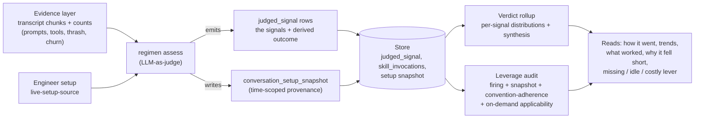
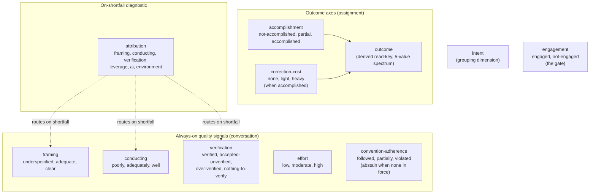
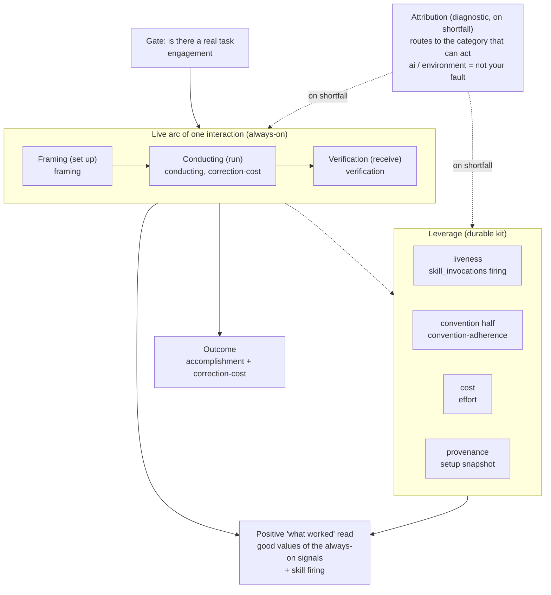
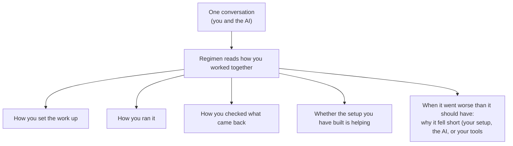
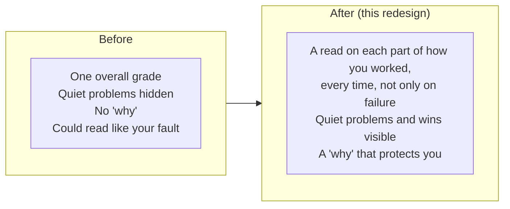

# Judged-signal taxonomy redesign (adopted design)

> Design pass, 2026-07-01. Architect-deep redesign of what `regimen assess` (the per-conversation LLM-as-judge) emits, driven by the settled `docs/regimen-categories-of-improvement.md`. ADOPTED 2026-07-03 via ADR-0017 (accepted); the six open questions in section 10 are resolved and the build is starting. Supersedes the failed three-signal redo (attribution + verification + adherence on top of the accomplishment/correction split). Companion ADR: `docs/adr/0017-judged-taxonomy-covers-the-categories-of-improvement.md`. Reconciles with the paused branch `feat/judge-prompt-setup-rubric` (see section 8).

## 0. The lead: this drives what the judge is built to emit

The purpose is to make `regimen assess` emit the judged signals that serve the four categories of improvement Regimen exists for, so the two co-equal cross-conversation reads (the verdict rollup and the leverage audit, ADR-0016) and the in-conversation checkpoints can deliver every read the driver names. Every decision below is measured against one test: does it change what the judge emits or what a consumer can read. If not, it is out.

The driver (`docs/regimen-categories-of-improvement.md`) demands one thing of any taxonomy: every category, the diagnostic, the gate, and both lenses must have a home, including the quiet no-shortfall cases and the first-class positive "what worked" read. The redo failed that test in five places (the section-3 forks of the seed brief). This redesign is built top-down from the driver, then checked against the code the signals must land in.

## 1. The core shape (the answer to Fork A)

The redo gave Framing and Conducting a home only through `attribution`, which fires only on a shortfall. That re-created, for every quiet case, the masking the redo had just fixed for Verification by making it always-on. The fix is structural and it governs the whole design:

**The live-arc categories each get an always-on quality signal that carries the good, neutral, and poor reads with a denominator; attribution is a separate, narrower, on-shortfall diagnostic that routes to one of them, never their only home.**

An always-on signal is what makes three driver-central things possible that a shortfall-gated signal cannot:

- The quiet-but-poor case has a home: a session that succeeded yet was poorly conducted (or succeeded despite vague framing) drives a real action and is now a stored value, not prose the rollup may not count.
- The trend exists: "is my framing chronically underspecified," "is verification chronically waved through" are rates, and a rate needs the good conversations in the denominator. A shortfall-only signal counts numerators with no denominator.
- The positive read is queryable, not inferred: `framing=clear`, `conducting=well-conducted`, `verification=verified`, `correction-cost=none`, `accomplishment=accomplished` are each a sliceable positive value. The driver makes the positive "what carried this success" read first-class precisely because it drives no immediate action but is valuable; a stored positive value is how it becomes representable and queryable rather than an inferred aggregate.

Attribution keeps its one job from the driver ("you do not improve attribution; you use it to pick the fix"): on a shortfall it names the dominant cause and routes to the category that can act, protects from misplaced blame (its `ai` and `environment` values), and scopes the options (an `environment` cause with one harness narrows to work-around-or-accept). It points; it is not the home.

### The pipeline at a glance

How a conversation becomes surfaced feedback: the judge reads the evidence layer plus the engineer's setup, emits the signals (and writes the provenance snapshot), and the two co-equal consumers read the store.



## 2. The redesigned signal set

All values are `categorical` or `ordinal`: no new `value-kind`, no structured/array value, no JSON-behind-a-number. Every signal fits the existing generic `judged_signal` row (ADR-0008) with zero schema change. Every emitted value is anchorable by positive evidence (Fork F); a not-applicable state is expressed by abstention (no row), never by an unanchorable value.

| Signal | Kind | Scope | Emission | Values | Driver home |
|---|---|---|---|---|---|
| `intent` | categorical | conversation | always-on | refactor / bug-fix / feature / test-writing / exploration / schema-change / other | grouping dimension for every read |
| `accomplishment` | ordinal | assignment | always-on | not-accomplished < partial < accomplished | Outcome (done-ness) |
| `correction-cost` | ordinal | assignment | always-on when accomplished | none < light < heavy | Outcome (steering); Conducting/Verification magnitude |
| `outcome` (derived) | ordinal | assignment | write-derived from the two axes | not-accomplished < partial < accomplished-under-heavy-correction < accomplished-under-light-correction < accomplished-cleanly | read-key preserving the load-bearing spectrum |
| `engagement` | categorical | conversation | always-on | engaged / not-engaged | the gate (real task) |
| `framing` | ordinal | conversation | always-on | underspecified < adequate < clear | Framing |
| `conducting` | ordinal | conversation | always-on | poorly-conducted < adequately-conducted < well-conducted | Conducting |
| `verification` | categorical | conversation | always-on, abstain-when-unclear | verified / accepted-unverified / over-verified / nothing-to-verify | Verification |
| `effort` | ordinal | conversation | always-on | low < moderate < high | cost reads (do-not-delegate, lever-cost) |
| `attribution` | categorical | conversation | on-shortfall only | framing / conducting / verification / leverage / ai / environment | Attribution (diagnostic) |
| `convention-adherence` | categorical | conversation | always-on, abstain-when-none-in-force | followed / partially-followed / violated | Leverage (convention half), real-time |

Ten emitted signals plus the derived `outcome` read-key. This is larger than today's three (intent, outcome, engagement), and the size is the faithful cost of covering four distinct categories, a diagnostic, a gate, and two cost reads with sliceable numbers rather than prose. Section 7 phases the build so the rubric grows incrementally with elicitation validation, and section 9 self-critiques the size.

The shape at a glance: nearly every signal is always-on (it carries good, neutral, and poor reads with a denominator), and only `attribution` is on-shortfall, routing to the category that can act.



### 2.1 Per-signal specification

**`intent`** (unchanged from today). Categorical, conversation-scoped, closed vocabulary, always-on. Names what the engineer was trying to do; the dimension every other read groups by. Anchor: the engineer's prompt chunk(s) stating the goal.

**`accomplishment`** (replaces the done-ness half of the old four-value ordinal). Ordinal `not-accomplished < partial < accomplished`, assignment-scoped, always-on. Owns done-ness only. Criteria:
- `not-accomplished`: no working result toward the stated intent was reached (cause-free; the reason lives in `engagement` and `attribution`, not here).
- `partial`: meaningful progress, intent unmet; sub-goals remain open or the result does not satisfy the intent. Stated without any steering qualifier so the judge stops fleeing the middle (taxonomy-review Finding 3).
- `accomplished`: the assignment's intent was met.
Anchor: the chunks showing the result reached or not reached.

**`correction-cost`** (the steering axis the corpus's dominant variance needs; taxonomy-review Finding 1). Ordinal `none < light < heavy`, assignment-scoped, emitted when `accomplishment=accomplished` (on `not-accomplished`/`partial` the floor already absorbs steering, so correction-cost abstains to avoid a meaningless cross-product). Owns how much the engineer redirected, corrected, or repaired the AI's course. The deterministic correction-rate (a reserved evidence signal) is its anchor, never copied into the judged row (ADR-0008 forward constraint). The `light` versus `heavy` split is the lower-confidence half; it degrades cleanly to a binary `none < corrected` if the judge cannot apply three values reliably. Anchor: the engineer's corrective turns.

**`outcome`** (write-time-derived read-key, not a primitive). Ordinal, assignment-scoped, computed by the writer from the two axes: `not-accomplished` -> floor; `partial` -> middle; `accomplished` mapped by correction-cost (`heavy` -> `accomplished-under-heavy-correction`, `light` -> `accomplished-under-light-correction`, `none` -> `accomplished-cleanly`). It exists solely so the four read sites and the `--outcome` filter that key on `signal_name='outcome'` (section 6) keep returning a scored spectrum with minimal churn, and so ADR-0008's load-bearing worst-to-best spectrum survives as a stored rank. It is judged-from-judged (a function of two judged axes), not a deterministic operand, so it does not violate ADR-0008's no-copied-operand rule. Anchor: the union of the two axes' anchors. Its presence tracks `accomplishment`'s presence (derivable only when accomplishment is anchored).

**`engagement`** (survives from the paused branch, with the wording fix). Categorical `engaged / not-engaged`, conversation-scoped, always-on, the gate. A non-task cannot fall short, so a `not-engaged` conversation is excluded from every "the AI fell short" denominator. The wording fix (taxonomy-review Finding 2): strike "a setup blip" from the `not-engaged` definition. A real assignment derailed by tooling is `engaged` and blocked (an accomplishment-and-environment fact), never never-engaged; conflating them is what drove the false `abandoned + not-engaged` verdicts. Anchor: the throwaway/detour/aborted-start turns for `not-engaged`; the earnest-work turns for `engaged`.

**`framing`** (new; Framing category). Ordinal `underspecified < adequate < clear`, conversation-scoped, always-on. How clearly the goal, scope, and context were stated and supplied at the outset, judged from the engineer's opening input(s). Positive value (`clear`) is part of the what-worked read; poor value (`underspecified`) is the Framing shortfall home even when the session still succeeded. Tone guard (section 9): surfaced only as a specific anchored pattern paired with a fix, never "you are bad at prompting." Anchor: the opening prompt chunk(s). Lowest-confidence of the process signals; degrades to binary `underspecified < clear`.

**`conducting`** (new; Conducting category, Fork A's homeless quiet case). Ordinal `poorly-conducted < adequately-conducted < well-conducted`, conversation-scoped, always-on. How the engineer ran the work in flight: decomposition, delegation and fan-out, autonomy granted, when to intervene, when to reset context. Distinct from `correction-cost` (a magnitude of steering) because it is a quality of steering: a well-conducted session can carry heavy correction (the engineer correctly caught and redirected). Distinct from `framing` (goal content versus execution shape). The diffuse-ness of the category is the reliability risk (open question OQ6); coarse ordinal, degrade to binary, lean on prose for the specific pattern. Anchor: the engineer's steering/decomposition turns.

**`verification`** (new; the driver's introspection-resistant category; answer to Fork E). Categorical `verified / accepted-unverified / over-verified / nothing-to-verify`, conversation-scoped, always-on in intent but abstain-when-unclear. Not an ordinal: both `accepted-unverified` (over-trust) and `over-verified` (under-trust, the wasteful-over-checking half the driver names) are off the healthy middle. Portability and emittability rules:
- A check must be VISIBLE in the transcript. A silent reader who accepts is transcript-identical to a blind accepter, so absence of a visible check is NOT read as "no check occurred." The judge emits `accepted-unverified` only on POSITIVE evidence of the skip: a substantive AI change followed immediately by the engineer moving on with no visible read-of-diff, run, or challenge. When it is genuinely unclear, the judge ABSTAINS (no row), which folds "unclear" into first-class absence rather than a value and keeps every emitted value anchorable.
- `nothing-to-verify` is a stored value (not abstention) so the rollup can exclude it from the over-trust denominator the way `engagement` excludes `not-engaged`; it is anchorable by citing the no-change turns (a question answered, an exploration).
- Cross-harness normalization (at the judge's reasoning level, harness specifics normalized at the capture edge): "accept" is the engineer proceeding past an AI change (a next prompt, or an explicit approval where the harness has one); "check" is the engineer's own visible act of reading, running, or challenging. A harness-automatic hook or test run is the environment, not the engineer's verifying act, so it does not count as `verified`.
- Anchor rule includes positive-evidence-of-skip: `accepted-unverified` cites the two chunks that bracket the absent check (the AI change and the accept). You cannot cite a non-event, so the bracketing events are the anchor.

**`effort`** (new; the de-parked minimal cost signal; answer to Fork D). Ordinal `low < moderate < high`, conversation-scoped, always-on. The grind of the AI's own path (tool thrash, stalls, repeated-file churn, self-recovery), independent of engineer correction. This is ADR-0016's third parked enrichment, de-parked minimally because the driver NAMES two live cost reads that need it. It rates an objective, deterministically-anchorable magnitude (the evidence layer's thrash/stall/churn counts are its anchors), NOT a subjective "value" or "worth." The two cost reads are consumer compositions of `effort` + `correction-cost` + `accomplishment` + `intent` (do-not-delegate-this-class = high effort on a recurring intent; lever-costs-more-than-it-saves = high effort/adherence across a lever's conversations). Regimen surfaces the cost; it never renders the "worth it" verdict, which is the engineer's decision (section 9 boundary). Anchor: the AI's grind chunks (thrashing tool calls, repeated edits).

**`attribution`** (new; the diagnostic, reshaped per Fork B). Categorical, conversation-scoped, ON-SHORTFALL only (emitted when `accomplishment` is below `accomplished`, or a live-arc quality signal is at its poor floor). Value is the single DOMINANT cause / routing target: `framing / conducting / verification / leverage / ai / environment`. Multi-cause is represented by COMPOSITION, not by an array value: on a shortfall where both `framing` and `conducting` sit at their poor floor, that pair IS the multi-cause picture, already sliceable, and attribution names the dominant one to route. This adds Fork B's requested `leverage` value (a missing/idle/conflicting lever caused the shortfall) and needs no new value-kind. The `ai` and `environment` values are the blame-protection the driver requires (a well-run session flubbed by the model or the tooling is explicitly not the engineer's fault). All values are anchorable: `ai` cites the AI's failing output chunk, `environment` cites the tool-failure/error chunk, `framing`/`conducting`/`verification` cite the engineer's input, `leverage` cites where a lever should have applied. The specific recurring pattern ("these three framing shortfalls are the same missing lever") is open-vocabulary and stays interpretive synthesis in the consumers (section 9), not a closed judged value.

**`convention-adherence`** (new; the AI-compliance half of the leverage audit; part of the Fork C answer). Categorical `followed / partially-followed / violated`, conversation-scoped, always-on but ABSTAIN when no conventions are in force at the conversation's time (abstention carries not-applicable, so every emitted value is anchorable). Whether the AI honored the engineer's stated conventions and rules, judged as an AI-action fact (not a person verdict, not software quality). One conversation-level signal, one row, no per-practice PK collision. It gives the rollup and the audit a SLICEABLE "conventions honored" rate that prose cannot (prose is barred as a number source), and it surfaces "you are not honoring your own convention X" LIVE, in the intra-conversation checkpoint. The specific convention violated is open-vocabulary and stays in the assessment prose. Anchor: the chunks where the AI honored or violated a stated convention.

## 3. Leverage is a three-part read, not one signal (the answer to Fork C)

The redo's per-practice `adherence` signal broke five ways at once (seed brief 3C). The resolution is to stop treating adherence as one always-on per-conversation judged signal and to decompose the leverage-audit input by ACTOR and by DETERMINISM, matching each part to the mechanism that actually fits it.

### 3.1 The candidate shapes considered

- **C1 (the redo): one per-practice always-on judged `adherence` signal.** Rejected by all five sub-problems. Per-practice rows collide on the `judged_signal` PK `(session_id, scope, assignment_id, signal_name)` under insert-or-replace (verified against `store.ts` migration v6 and `writer.ts`); the only migration-free shape is one structured value, which needs a new value-kind and hides per-practice counts behind JSON extraction, defeating the SQL-owns-numbers spine both consumers depend on. It also conflates three actors (engineer-invoked skill use, model-invoked skill firing, AI convention-compliance) under one "honored," and its provenance reads today's filesystem for every `asOf`.

- **C2 (structured value + keyed schema): admit a `(session_id, practice_id)` adherence table.** Rejected. It owns a real migration (a fifth judged table keyed by practice), re-introduces a practice-id namespace the judged layer deliberately never had, and still conflates the three actors under one column. It solves storage but not actor, provenance, roster-blindness, or practice-kind asymmetry.

- **C3 (decompose by actor and determinism): the pick.** Adherence is not one assess signal. It is the composition, at AUDIT time, of a deterministic firing layer, a provenance snapshot, one always-on judged convention signal, and an on-demand targeted judge pass.

### 3.2 The four parts of C3

1. **Model-invoked skill firing: deterministic, already built.** Whether a skill fired in a conversation is a fact the evidence layer already records: `skill_invocations (session_id, skill_name, invocation_count, last_invoked_at)` (`store.ts` migration v3, projected in `projections.ts`, read in `evidence.ts`). The leverage audit reads this cross-conversation. "Fired zero times when it should have" is the silent-non-firing the audit exists for (ADR-0016), and detecting it needs no judged signal for the firing half. This dissolves sub-problem 1 (no per-practice judged rows, no PK collision), sub-problem 3 (firing is a fact, neither actor's compliance), and sub-problem 5 (skills DO have a firing count; the asymmetry is real and is handled by using a different mechanism for the other kind, below).

2. **Provenance: a conversation-time setup snapshot (new, additive migration).** The paused branch's `live-setup-source.ts` reads today's filesystem for every `asOf`, so a bulk sweep would fault conversations that predate a lever, the exact thing ADR-0016 and the leverage-audit design forbid. Fix: `regimen assess` writes a small conversation-time snapshot of the roster in force, keyed by session. This makes the roster and each convention's identity time-scoped and re-judge-stable. It is the one honest schema addition the redesign needs (migration v7); it does NOT touch `judged_signal`. Storage shape:

   ```
   CREATE TABLE conversation_setup_snapshot (
     session_id  TEXT PRIMARY KEY NOT NULL,
     captured_at TEXT NOT NULL,           -- the conversation's asOf, not now
     practices   TEXT NOT NULL,           -- JSON: [{ name }]
     conventions TEXT NOT NULL            -- JSON: [{ scope, sha256 }]  (hash, not text)
   ) WITHOUT ROWID;
   ```

   The snapshot stores practice NAMES and a per-convention content HASH, not full text: it is a provenance echo (what existed, and did the convention change), not a second copy of the conventions. The audit reads the snapshot for a conversation's time instead of the live filesystem. `live-setup-source.ts` stays the adapter that produces `EngineerSetup` for the prompt; the snapshot is its persisted, time-anchored echo. Full convention-TEXT versioning (diffing reworded conventions) is deferred and flagged (OQ5); the hash detects that a convention changed, which is enough to gate stale comparisons. The cheaper fallback if the snapshot table is judged too heavy: a first-seen gate derived from the store (a skill's first `last_invoked_at`, a convention's first-seen date), which time-scopes EXISTENCE but not wording; recommended only if the snapshot is deferred.

3. **AI convention-compliance: the `convention-adherence` always-on signal (section 2.1).** The convention/rule half is an AI-action, so it is a judged signal, one per conversation, sliceable, real-time-visible. This is the only judged part of adherence that lives in the assess layer, and it is per-conversation, so it has no PK collision and no actor conflation.

4. **Skill applicability: an audit-time targeted judged read (capability 2, not an assess signal).** "This model-invoked skill did not fire, but SHOULD it have here" is judged, but per-practice and open-ended, so it is not an always-on assess signal (that is the collision path). It is exactly what the leverage-audit design already specifies: at audit time, for each time-scoped-rostered skill that did not fire, a judge pass handed THAT practice's own definition as the rubric. This is a consumer-side read over the filtered set, on demand, not a per-conversation write. It keeps the open-ended per-practice judgment out of the generic row.

### 3.3 What C3 does and does not cover

- Sub-problem 2 (provenance): fixed by the snapshot; full text-versioning flagged.
- Sub-problem 3 (actor conflation): fixed by splitting firing (fact) / applicability (audit judge) / convention-compliance (assess judge) / engineer-use (Conducting + firing).
- Sub-problem 4 (roster blindness): a good practice never declared as a rostered file is invisible to adherence, and no roster-based check can fix that. It is covered elsewhere: the ACQUIRE-a-missing-lever read (Leverage liveness = missing) is inherently open-vocabulary and is the rollup's interpretive job ("you keep doing X by hand; a lever likely exists"). This is the correct boundary, not a taxonomy gap. Flagged honestly.
- Sub-problem 5 (practice-kind asymmetry): skills use the deterministic firing test; conventions use the `convention-adherence` trend (a convention `violated` or never-in-force across N conversations is a retire/revise candidate). The tests run per-kind with the mechanism that fits, not uniformly, because the kinds genuinely differ.

## 4. Attribution's shape, finalized (the answer to Fork B)

- **Multi-cause**: primary cause is the `attribution` value; contributing causes are read by composing the always-on category signals that also sit at their poor floor on the same conversation. No array value, no new value-kind. A shortfall with both `framing=underspecified` and `conducting=poorly-conducted` is the multi-cause representation, sliceable today.
- **Recurring-pattern clustering**: the sliceable COUNT is available (attribution grouped by value, and the category signals grouped by value). The SPECIFIC pattern that discriminates "the same missing lever" is open-vocabulary and therefore cannot be a closed judged value without becoming the escape hatch ADR-0008 forbids; it stays interpretive synthesis in the rollup and audit, reading the prose. This is a boundary, not a gap: naming an arbitrary missing lever is not enumerable.
- **The leverage value**: added (`attribution=leverage`), so a live kit conflict or a missing/idle lever that caused a shortfall has a home and routes to the Leverage category.

## 5. Verification, finalized (the answer to Fork E)

Covered in the `verification` spec (section 2.1). In summary: visible-check-only with positive-evidence-of-skip anchoring; abstain-when-unclear so absence is never read as no-check; a `nothing-to-verify` value for no-AI-change sessions; cross-harness normalization of "check" and "accept" with harness-automatic runs excluded as the environment's act; and `over-verified` covering the under-trust half the old value set omitted. Every emitted value is anchorable, so the mandatory-anchor invariant in `buildSignals` stands unchanged.

## 6. Store and read-layer changes (the answer to Fork F, expanded against the code)

The redo waved this away; here it is owned. Verified against the code, the read surface that keys on the Outcome value is BROADER than the seed brief stated: four read sites plus a user-facing filter and a list column, not two.

### 6.1 Store changes

- **`judged_signal`: no schema change.** All ten emitted signals plus the derived `outcome` fit the generic row. Conversation-scoped signals (`intent`, `engagement`, `framing`, `conducting`, `verification`, `effort`, `attribution`, `convention-adherence`) use `scope='conversation'` with the empty-string `assignment_id` sentinel and a distinct `signal_name`, so their PKs `(session_id,'conversation','',signal_name)` are unique. Assignment-scoped signals (`accomplishment`, `correction-cost`, `outcome`) use `assignment_id='whole-conversation'` with distinct `signal_name`. No collisions. This VALIDATES ADR-0008's generic row rather than overturning it, and it directly refutes the redo's false no-migration claim by showing the design that IS migration-free.
- **One additive migration (v7): `conversation_setup_snapshot`** (section 3.2). Additive, does not touch existing tables, honest about being a migration.
- **No new `value-kind`.** Multi-cause via composition, not-applicable via abstention, and the derived spectrum is still `ordinal`. `categorical` and `ordinal` remain the only live kinds.

### 6.2 Read-layer changes

- **The four sites that key on `signal_name='outcome'` keep working** because the writer stores a derived `outcome` (section 2.1). Only their value ORDER updates. The sites:
  - `packages/feedback/src/judged/slice.ts` (`listJudgedSessions`, `LEFT JOIN ... signal_name='outcome'`).
  - `packages/feedback/src/sessions.ts` (`listSessions`, same join, plus the `--outcome` filter clause `s.value = json_quote(?)`).
  - `packages/feedback/src/judged/digest.ts` (`signals.find(s => s.signalName==='outcome')` for the headline).
  - `packages/feedback/src/judged/rollup.ts` (`OUTCOME_ORDER`).
- **`OUTCOME_ORDER` and every worst-to-best assumption move from 4 values to the 5-value derived spectrum** (`rollup.ts`, and any renderer that assumes the four names). The old values re-project losslessly: `accomplished-cleanly` -> `accomplished-cleanly`, `accomplished-with-correction` -> `accomplished-under-light/heavy-correction`, `partial` -> `partial`, `abandoned` -> `not-accomplished` (with the cause now in `engagement`/`attribution`).
- **The `--outcome` list filter accepts the 5 new values** (a documented CLI surface change; `packages/cli/src/cli/index.ts` and `sessions.ts`). Filtering on the old `accomplished-with-correction` becomes filtering on the two correction-split values.
- **`rollupHeader` generalizes from a single hardcoded Outcome tally to per-signal distributions.** To make every always-on signal a trustworthy number for both consumers (not prose), the deterministic header reads `GROUP BY signal_name, value` over the judged set, returning a distribution per signal (outcome, accomplishment, correction-cost, engagement, framing, conducting, verification, effort, convention-adherence) rather than only outcome. This is the concrete "new signals only become trustworthy numbers with deterministic reads" plumbing. The synthesis layer still owns zero numbers.
- **`listJudgedSessions`/`listSessions` widen to `SessionFilter`** as the verdict-rollup design already resolved (since/until), unchanged by this redesign.
- **The leverage audit reads** `skill_invocations` + `conversation_setup_snapshot` + `convention-adherence` distributions + on-demand per-practice judged passes; it adds no `judged_signal` read that the generic header does not already expose.

### 6.3 Anchors and the mandatory-anchor invariant

`buildSignals` drops any signal with zero anchors, and `buildNarratives` drops the assessment with zero anchors (verified in `judge.ts`). The redesign keeps this invariant untouched by designing only anchorable states: every value cites positive evidence (including positive-evidence-of-skip for `verification=accepted-unverified` and the causing-event for `attribution=ai`/`environment`), and every not-applicable state (`convention-adherence` with no conventions in force, `verification` when unclear, `correction-cost` when not accomplished) is expressed by ABSTENTION, not by an unanchorable value. No anchor-optional path is added.

## 7. The redesigned signal set mapped to every driver element (coverage)

The same coverage as a picture: the gate precedes the live arc (each beat with its always-on signal) over the durable Leverage kit, with attribution routing in only on a shortfall, and the positive read falling out of the always-on signals' good values. The exhaustive mapping follows in the table.



| Driver element | Home |
|---|---|
| Framing (set up) | `framing` always-on; `attribution=framing` on shortfall |
| Conducting (run) | `conducting` always-on; `correction-cost` magnitude; `attribution=conducting` on shortfall |
| Verification (receive) | `verification` always-on; `attribution=verification` on shortfall |
| Leverage: liveness (missing) | interpretive ACQUIRE read (rollup); `attribution=leverage` on shortfall |
| Leverage: liveness (idle/dead) | deterministic `skill_invocations` (firing=0 over time) + audit no-op test |
| Leverage: liveness (working, positive) | `skill_invocations` firing>0 + the positive values of the always-on signals |
| Leverage: cost (net-negative) | `effort` + `convention-adherence` composed across a lever's conversations |
| Leverage: convention honored | `convention-adherence` always-on (sliceable) + prose (which convention) |
| Leverage: whole-kit scope (conflict/redundancy) | audit cross-lever interpretive synthesis (not a per-conversation signal) |
| Leverage: time-scoping / provenance | `conversation_setup_snapshot` (v7) |
| Attribution (diagnostic) | `attribution` on-shortfall; multi-cause via composition; cost-note via `effort` |
| Gate (real task) | `engagement` |
| Cost: do-not-delegate-this-class | `effort` + `intent` + `accomplishment` composed |
| Cost: retire/loosen a costly lever | `effort` + `convention-adherence` + `skill_invocations` composed |
| The positive "what worked / what carried this" read | positive values of `framing`/`conducting`/`verification`/`correction-cost`/`accomplishment`/`convention-adherence` + `skill_invocations` firing, all queryable |
| Lens: time-range | `SessionFilter` since/until; always-on signals supply the trend denominators |
| Lens: harness + model | the `conversations` join (`slice.ts`), unchanged, works for every signal |
| Outcome (done-ness + steering) | `accomplishment` + `correction-cost`, derived `outcome` spectrum |
| Intent | `intent` (grouping dimension) |

Every category, the diagnostic, the gate, both lenses, the quiet cases, and the positive read have a home. The three residuals (specific recurring-pattern naming, undeclared missing levers, whole-kit conflict) are interpretive-by-nature (open-vocabulary or cross-lever), covered by the consumers' prose synthesis, and are boundaries rather than gaps (section 9).

## 8. Reconciliation with the paused branch and the re-sweep (seed brief section 5)

The branch `feat/judge-prompt-setup-rubric` (eight committed, unmerged, all-green commits) is NOT wasted; most of it carries forward.

- **Survives unchanged**: the version-centralization (`versions.ts`, Unit 1); the setup-injection plumbing (`buildJudgePrompt(chunks, setup?)`, `EngineerSetup`/`SetupSource`/`ConventionSource`/`EstablishedPractice`, and the threading through `assess.ts`/`judge.ts`/the CLI). The redesign REUSES this plumbing: `framing`, `conducting`, and `convention-adherence` all need the engineer's setup in the prompt, so the setup input is now load-bearing for more than the adherence instruction.
- **Survives with a wording fix**: the `engagement` signal. Strike "a setup blip" from the `not-engaged` definition (section 2.1, taxonomy-review Finding 2).
- **Changes**: the four-value Outcome per-label criteria (Decision 4, commit `1548fdeb20`) are REPLACED by the two-axis `accomplishment` + `correction-cost` criteria and the derived spectrum. That commit's rubric text is superseded, not built on.
- **Implicated and extended**: `live-setup-source.ts` stays the adapter but gains a persisted echo (`conversation_setup_snapshot`, section 3.2) so the leverage audit is time-scoped rather than reading today's filesystem. The adapter's roster-blindness and actor-conflation concerns are resolved at the CONSUMER by the actor split (section 3), not in the adapter.
- **The re-sweep** (`assess --all --force`), the branch's original goal, is DEFERRED until this redesign lands, so it grades against the redesigned taxonomy rather than the interim enriched-but-still-four-value rubric. The branch's re-sweep intent is subsumed into the redesign's re-sweep (section 8.1).

### 8.1 Build-and-re-sweep sequence

Phased so the rubric grows with elicitation validation, and so ONE full re-sweep runs against the finished taxonomy (not multiple expensive sweeps).

1. **Read-layer and store foundation** (no rubric change yet, so no re-judge needed): migration v7 (`conversation_setup_snapshot`); generalize `rollupHeader` to per-signal distributions; add the write-time `deriveOutcome(accomplishment, correction-cost)` helper; teach the four `outcome` read sites and the `--outcome` filter the 5-value spectrum. TDD units, each green before the next.
2. **Core rubric (re-sweep-critical)**: replace the Outcome ordinal with `accomplishment` + `correction-cost` (+ derived `outcome`); fix `engagement` wording; add `verification` and `attribution`. Bump `RUBRIC_VERSION` and `PROMPT_VERSION`.
3. **Extended rubric**: add `framing`, `conducting`, `effort`, and `convention-adherence` (the last consumes the setup already threaded). Bump versions again if built as a second landing.
4. **Elicitation validation on a small sample** (5 to 10 real conversations, cheap): confirm each new signal parses, anchors, and abstains honestly rather than mis-firing. Any signal that abstains too often or mis-fires is DEFERRED (ships as abstain-only) rather than shipped unreliable; this is where the diffuse `conducting` and the newest `effort` are proven or deferred (OQ6).
5. **One full re-sweep**: `regimen assess --all --force` over the corpus. This is the only thing that migrates judged values; it repopulates every conversation against the redesigned taxonomy and stamps the bumped versions so old and new verdicts are distinguishable. Note: between deploying the new readers and finishing this sweep, conversations still holding old `outcome` rows read losslessly (the derived spectrum re-projects them), and signals that did not exist before are simply absent until re-judged.
6. **Build the two consumers** against the repopulated store: the verdict rollup (generic per-signal header + synthesis) and the leverage audit (deterministic firing + snapshot + `convention-adherence` + on-demand applicability).

## 9. Self-critique

Checked against the driver and the section-3 findings.

- **Does every category have a home, including the quiet cases and the positive read?** Yes (section 7). The quiet-but-poor cases land on the always-on `framing`/`conducting`/`verification`/`effort` values; the positive read is the queryable positive values of those signals plus deterministic firing. Fork A's four homeless cases (succeeded-but-poorly-conducted, idle/missing lever, well-run-but-not-worth-it, the positive read) each have a home that fires independent of a shortfall.
- **Does anything force a verdict on the person?** The risk concentrates in `framing`, `conducting`, and the cost reads. Mitigations, all from the driver's own tone guard: every value is a factual, anchored interaction property of the CONVERSATION, never a trait; the mandatory anchor enforces the specific-pattern discipline (a value cannot be stored without citing what happened); the surface (rollup/skill) must render "in this conversation the scope was not stated up front [anchor]; next time state X," never "you are bad at framing." The cost reads surface `effort` and let the engineer decide worth; Regimen never stores a "not worth it" verdict. `convention-adherence` is an AI-action fact, not a person verdict. This holds the boundary, but the SURFACE wording is where it could still be violated, so the design constrains the renderer, not just the signal (flagged for the consumer builds).
- **Does the generic store actually hold it?** Yes, honestly: zero `judged_signal` schema change, no new value-kind, no PK collision (verified against `store.ts` and `writer.ts`); exactly one additive migration (`conversation_setup_snapshot`), named as a migration. The redo's "no migration" claim was false for its per-practice shape; this design earns the near-migration-free property by construction and is explicit about the one table it does add.
- **The honest residuals** (boundaries, not gaps): naming a specific recurring pattern or a specific missing lever is open-vocabulary and stays interpretive synthesis; whole-kit lever conflict is cross-lever and cannot be judged from one conversation; the "worth it" verdict is deliberately not rendered. Each is the correct boundary given the constraints (closed vocabulary, one-conversation scope, surface-not-verdict).
- **The honest risk**: ten always-on-plus-conditional signals is a large per-call elicitation load, and `conducting` is diffuse. The mitigations are abstention-is-first-class (an ungroundable signal is simply absent), the phased build with sample validation (section 8.1 step 4), and degrade-to-binary for the low-confidence ordinals. This is a real reliability risk, surfaced as OQ6, not buried.

## 10. Open questions (all six RESOLVED 2026-07-03; recommendations kept for the reasoning)

- **OQ1 (from the taxonomy-review, unchanged)**: does the steering dimension belong INSIDE Outcome as a co-equal stored axis (this design's assumption, `correction-cost`), or should Outcome reduce to pure `accomplishment` with steering deferred to a future rostered deterministic correction signal? Recommendation: co-equal stored axis now, because it keeps the corpus's dominant variance first-class and the deterministic correction-rate becomes its anchor, not its only home. The n=29 success-skewed single-harness corpus underdetermines this; it is the one call the data cannot settle. **RESOLVED (2026-07-03): `correction-cost` stays a co-equal stored axis alongside `accomplishment`; Outcome is not folded into a single ordinal.**
- **OQ2**: de-park `effort` now, or scope the two cost reads as deferred? Recommendation: de-park, because the driver NAMES both cost reads and a taxonomy that cannot deliver a named driver read is incomplete; `effort` is objective and deterministically anchorable, so it does not smuggle in software-quality grading. It is the most deferrable signal if the set proves too heavy. **RESOLVED (2026-07-03): the `effort` axis is de-parked; build it now.**
- **OQ3**: is `convention-adherence` a distinct always-on assess signal (this design's choice), or only an audit-time judged read? Recommendation: assess signal, because it gives a sliceable convention-honored rate (prose cannot) and surfaces convention drift LIVE in the intra-conversation checkpoint. Borderline; defensible as an audit-time read if the always-on load must be cut. **RESOLVED (2026-07-03): `convention-adherence` is always-on, not audit-only.**
- **OQ4**: provenance depth: the `conversation_setup_snapshot` (roster names + per-convention hash, this design's choice) versus a cheaper store-derived first-seen gate versus full convention-text versioning. Recommendation: the snapshot now (time-scopes existence and detects a changed convention via the hash); full text-diff versioning deferred; first-seen gate only as the fallback if the table is deferred. **RESOLVED (2026-07-03): provenance via the `conversation_setup_snapshot` table (roster names + per-convention hash).**
- **OQ5**: the derived `outcome` read-key: stored write-time (this design's choice, minimal read-surface churn across four sites plus the filter) versus derived read-time (purer, no stored redundancy, but rewrites four read sites and redefines the `--outcome` filter). Recommendation: stored write-time, because the verified read surface is broader than the brief assumed and stored derivation keeps all of it working with only an order/value-list update; the redundancy is one documented row. **RESOLVED (2026-07-03): the derived `outcome` read-key is stored at write time.**
- **OQ6**: elicitation reliability and per-call load of the always-on set, especially the diffuse `conducting` and the newest `effort`. Recommendation: validate on a small sample before the full re-sweep (section 8.1 step 4), degrade the low-confidence ordinals to binary, and defer (ship abstain-only) any signal that mis-fires rather than shipping it unreliable. This is a build-time calibration gate, not a taxonomy question, but it is the one most likely to change the shipped set. **RESOLVED (2026-07-03): reliability is a build-time gate: sample-validate on 5-10 real conversations; degrade low-confidence ordinals to binary; any mis-firing signal ships abstain-only or is deferred. `conducting` and the new `effort` are the two signals to prove or defer.**

## 11. The redesign at a high level (for product and users)

Everything above is the low-level design. Here is the whole idea in plain language, for someone who wants to understand what `assess` does without the signal names.

Regimen assess reads one conversation between you and the AI and, instead of handing back a single pass-or-fail grade, it reads each part of how you worked together. It does this every time, not only when something breaks. That is what lets it show you the quiet problems and the things that actually went well, and tell you why when a session fell short, without ever pinning the AI's or a tool's failure on you.

What it reads about a conversation:



What changed, and why it matters:



The payoff: you can see not just whether a session worked, but where it could have been better even when nothing broke, what carried the wins, and, over time and across different AI tools, whether the changes you make actually help.
