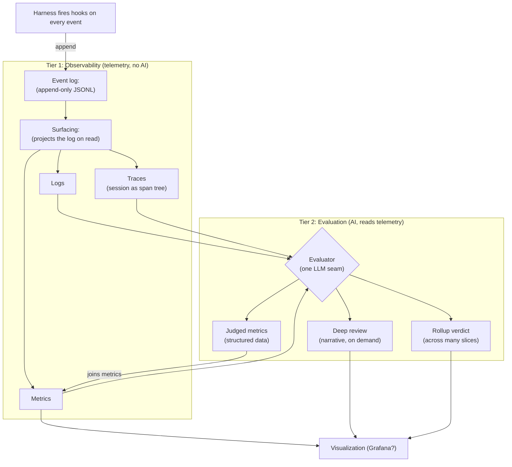

# Observability module: telemetry and evaluation

> **In plain terms.** This watches your AI coding sessions and turns them into data: how often you correct the model, which skills you use, how long sessions run, where things drift. The bottom tier is pure telemetry with no AI in it, the same three shapes OpenTelemetry uses (logs, metrics, traces). The top tier is optional: an AI reads that telemetry and produces a few judgment calls, a readable review of a stretch of work, or an objective verdict over a whole month. You review the data instead of taking notes.

The observability module is a sibling to **shepherd** and the base for an optional **visualization** layer. It has two tiers. Tier 1 is the telemetry layer: deterministic, continuous, no AI. Tier 2 is the evaluation layer: an LLM that reads the telemetry and produces judged outputs. Tier 1 is fully useful on its own; Tier 2 layers on top.

**Design driver:** nothing the system needs may depend on the operator noticing or remembering anything, and the telemetry layer must stay objective. Capture is deterministic and continuous. The evaluation tier reads telemetry, not raw conversation, so it judges from data rather than from the session's own account of itself.

## The two tiers

- **Tier 1: Observability (telemetry, no AI).** Hooks capture events continuously into an append-only log. That log is projected, on read, into the three OpenTelemetry signal shapes: logs, metrics, traces. Deterministic end to end. This is what the operator uses constantly and what visualizations are later built on.
- **Tier 2: Evaluation (AI, reads the telemetry).** One LLM seam with three jobs: judged metrics, deep review, and a rollup verdict. Every job reads Tier 1 telemetry as its primary input. Optional, layered on top, and earns its keep most during a bounded evaluation such as the Gemini trial.

## Tier 1: the telemetry layer

### Capture

A capture hook registered in each harness's own hook config. The harness fires session events; the hook normalizes the payload into the shared event schema and appends it to the log. Capture is **continuous**: events stream in as they happen, through every compaction, for as long as a session runs. There is no trigger and no session boundary to wait on. There is no separate running service; capture is the harness invoking a hook.

The event schema carries enough structure to support all three signal shapes: a timestamp and attributes (harness, model, model version, session id, tool name, file path) for logs and metrics, and span fields (span id, parent span id, start, end) so the flat log reconstructs into a trace.

### The event log

One append-only JSONL file is the single stored artifact. Metrics and traces are not stored separately; they are projections computed from the log on read. A separate metrics store or trace store would hold nothing the log does not already imply.

### Surfacing: the three signal shapes

The surfacing interface reads the event log and projects it into the three OpenTelemetry signal shapes:

- **Logs.** The event stream itself, each event a structured record with attributes. Text plus labels, queryable.
- **Metrics.** Counts and aggregations over the events. Deterministic. See the metric tables below.
- **Traces.** A session reconstructed as a span tree: the session is a trace, each turn a span, each tool call a nested span, compactions as markers on the timeline. The Gantt view of a session.

### Units are read-time slices

The telemetry has no unit baked in. A "unit" is a slice chosen at read time, because every event carries a timestamp and a session id, and compaction events and checkpoint markers are in the stream. Supported slices:

- **Time window**, rolling or fixed. Always available, the consistent fallback.
- **Session id**, the harness session, however long it ran.
- **Compaction segment**, the span between two compactions, a natural chapter inside a long session.
- **Checkpoint**, the span between two `continue`-skill invocations, since that is the operator deliberately marking a boundary.

A short conversation the operator started and finished deliberately is captured exactly by its session id, so slicing by session never loses it. Time is one option, never the only one.

## Metrics

Metrics are **counted** (deterministic, computed by Surfacing directly from the log) or **judged** (produced by the Tier 2 evaluator, emitted as structured data that joins the same metric space). Everything the system surfaces is a metric; the only difference is whether the value was computed by arithmetic or by an LLM.

### Counted directly from the event log

| Metric | What it is | Value it provides | How it is counted consistently |
|---|---|---|---|
| Skill-usage frequency | Count of skill activations, grouped by skill | Shows which skills earn their keep and which are dead weight | Every skill runs as a `Skill` tool call, so count `PreToolUse` events where `tool_name == Skill`, grouped by the skill argument. A skill invoked then abandoned still counts as invoked. |
| Tool activity volume | Count of tool calls per slice, by tool type | Session intensity and the *kind* of work (read-heavy vs edit-heavy) | Count `PreToolUse`/`BeforeTool` events, grouped by `tool_name`. Fully portable across all three harnesses. |
| Compaction count | Number of context compactions in a slice | Surfaces context pressure (long sessions losing state) | Count `PreCompact`/`PostCompact` events. **Claude-only**: a 0 on Codex/Gemini means *unobserved*, not *none*. Reported with a per-harness availability flag. |
| Session duration | Wall-clock span of a session | Time cost; denominator for throughput | First event timestamp to last event timestamp for a session id. An in-progress session reports its duration so far; it does not wait on a session-end event. |
| Drift-gate denials | Count of tool calls a hook denied | How often deterministic discipline gates actually caught something | Capture the `PermissionDenied` hook event, which fires whenever a gate denies a tool call, so no per-hook cooperation is needed. Reads zero until discipline hooks (Shepherd-style) exist to produce denials. |
| Repeated-file edits | Files edited more than N times in one slice | A thrash/rework heuristic (churn on the same file) | Count `Edit`/`Write` events grouped by file path; flag paths over a threshold. Heuristic only: iterative work edits a file repeatedly by design, so read it alongside the judged correction rate. |
| Turn count | Number of operator prompts in a slice | Conversation length; the denominator for correction rate | Count `UserPromptSubmit`/`BeforeAgent` events. |

**Harness is a filter dimension, not a metric.** Every figure above can be scoped to one harness, so a single model is evaluated on its own terms: "correction rate on Gemini" against "correction rate on Claude." A cross-harness *distribution* is not tracked, because work is routed to harnesses deliberately, so the split carries no signal.

### Judged by the evaluator

These four cannot be derived by counting; they require an LLM to read the telemetry and make a judgment. They are emitted as structured data points, on the same footing as the counted metrics, so they aggregate and trend the same way.

| Metric | What it is | Value it provides | How it is judged consistently |
|---|---|---|---|
| Correction rate | Share of operator turns that redirect, reject, or override the model | The headline "how much am I fighting the model" number | The evaluator classifies each operator turn in the slice as correction or continuation against a fixed rubric. Rate is corrections divided by turn count; the counted turn count caps it. |
| Drift incidents | Moments the model went off-spec or did something it should not have | Catches bad behavior without the operator flagging it live | The evaluator scans the trace for off-spec actions against the rubric and emits a list, each with the triggering event reference. |
| What-helped signals | Hooks, skills, or interventions that visibly improved the trajectory | Positive signal; informs which patterns are worth lifting into hooks | The evaluator correlates trajectory recovery with the preceding hook or skill event and names it. |
| Session outcome | Goal met, partial, abandoned, or unclear | Success rate trended over time and per harness | The evaluator classifies the slice result against the rubric, cross-checked against whether the slice ended cleanly or was abandoned mid-task. |

**Consistency mechanisms for judged metrics.** Four things keep judged numbers stable enough to trend: (1) a fixed rubric embedded in the evaluator prompt with explicit definitions of *correction*, *drift*, and *goal met*; (2) a strict JSON schema for the judged-metrics output, so shape never varies; (3) the evaluator runs detached, reading telemetry rather than the session's own context, so it cannot rationalize; (4) judged values are cross-checked against the counted anchors, so correction count cannot exceed turn count and referenced skills must exist in the tool-call log. A mismatch is flagged, not silently trusted.

## Tier 2: the evaluation layer

The evaluation tier is one LLM seam with three jobs. Every job reads Tier 1 telemetry as its primary input and may consult conversation text only as a fallback. Reading data rather than transcripts is the objectivity guarantee: the evaluator judges from metrics, traces, and logs, not from the session's own narration of why it did what it did.

- **Judged metrics.** For a chosen slice, the evaluator produces the four judged metrics as structured data. They join the metric space next to the counted metrics.
- **Deep review.** On demand, for a chosen slice, the evaluator produces a readable narrative: the notes-equivalent. Not automatic, not part of Tier 1. The operator reaches for it, and it earns its keep most during the Gemini deep-dive over a month of conversations. A deep-review narrative follows a fixed shape so reviews are scannable in sequence: goal, trajectory, drift and corrections, what helped, outcome.
- **Rollup verdict.** On demand, the evaluator reads the whole metric space (counted and judged) across many slices and produces an objective overall assessment, for example how the Gemini trial went. Because it reads metrics, not transcripts, it stays objective.

Evaluation is never blocked. Capture is continuous, so any past slice can be evaluated at any time, on demand or on a cadence. There is no trigger to miss and no session boundary to wait on.

### The evaluator seam

The seam between the evaluation logic and the actual LLM is a port (dependency category 4: the model or agent is third-party and changes underneath us).

- The evaluation logic, which telemetry to feed, the rubric, parsing the result, and cross-checking judged values against counted ones, is the module's own work, written once.
- The seam is one method. The evaluation logic hands over structured material and gets back a result or a typed failure (unavailable, timeout). It never crashes.
- One small adapter per LLM: Claude, Codex, and Gemini headless, plus a direct model API, plus a canned test adapter so the evaluation logic is testable with zero model calls. A recording adapter turns one real call into a fixture.
- The adapter only ever sees telemetry material, never a live session, so the evaluator runs detached and cannot rationalize.

## Implementation decisions

- **Capture is continuous; there is no trigger.** Telemetry streams in as events happen. Nothing waits on a session ending, which matters because sessions run through many compactions and rarely end cleanly.
- **One stored artifact.** The append-only event log. Logs, metrics, and traces are read-time projections of it.
- **Units are read-time slices**, not a fixed boundary: time window, session, compaction segment, checkpoint.
- **No AI in Tier 1.** The telemetry layer is fully deterministic. All AI lives in Tier 2 and reads telemetry.
- **The evaluator seam is a one-method port** with per-LLM adapters and a canned test adapter; failure is a return value, not an exception.
- **Model is a first-class attribute, distinct from harness**, so a single model can be evaluated on its own terms.
- **The event schema is a versioned semantic convention**, the keystone for cross-harness comparability, and carries span fields so the log reconstructs into traces.
- **Capture adapters are built from the harness portability studies.** The per-harness hook payloads the capture hook normalizes are documented in `niftymonkey/skills/docs/portability/`. A capture adapter is built against the relevant `<harness>.md` and re-verifies it first. The dependency is one-directional and informational, never code.

## Architecture

Tier 1 captures and projects telemetry with no AI. Tier 2 reads that telemetry and adds AI-built outputs. The judged metrics flow back into the metric space, so a later rollup reads counted and judged values together.

## Status

Phase -1, Step 8 design, settled. The module is two tiers: a deterministic telemetry layer (Tier 1) and an optional AI evaluation layer (Tier 2). Open for the build phase: the exact judged-metrics JSON schema, the evaluator's default cadence for producing judged metrics automatically, and the structured shape of the rollup verdict.
